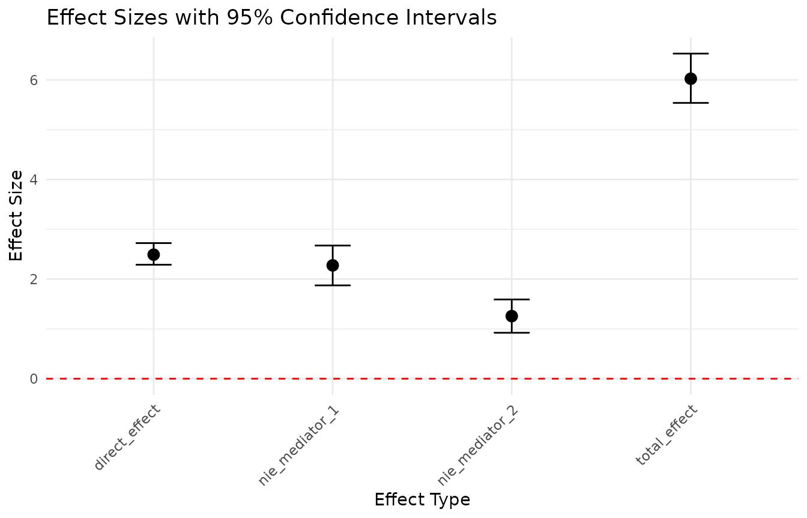
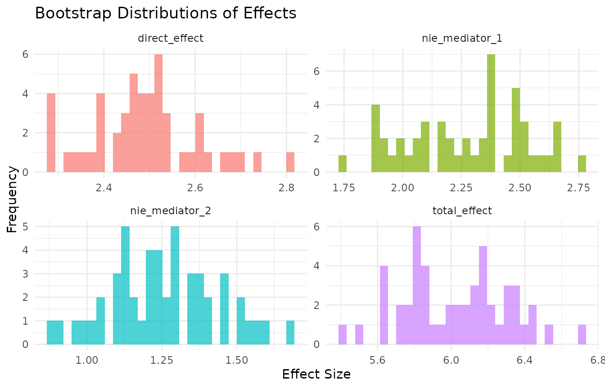

# Getting started with BriDGE

## Why BriDGE?

Randomized controlled trials (RCTs) tell you *whether* an intervention
works. They are rarely designed to tell you *why and how* it works —
which mediators carry the effect, whether relationships are nonlinear,
and whether your theoretical causal model is actually consistent with
the data.

BriDGE implements the protocol described in the companion paper (Veltri
& Banerjee, in press, *Behavior Research Methods*), combining:

1.  **A researcher’s DAG** — your theoretical causal model of the
    experiment.
2.  **Causal discovery** — structure learning constrained by
    experimental design facts (the randomized treatment can affect other
    variables, but nothing can cause the treatment).
3.  **GAM-based mediation analysis** — direct and indirect effects
    estimated with flexible smooth functions instead of rigid linear
    terms.
4.  **Bootstrap inference and sensitivity checks** — so effects come
    with uncertainty and robustness information.

This vignette walks through the full workflow on synthetic data where
the ground truth is known.

``` r

library(BriDGE)
```

## 1. Data

[`bridge_generate_data()`](https://gav888.github.io/BriDGE/reference/bridge_generate_data.md)
generates a synthetic two-arm RCT with a binary `treatment`, two
mediators, and a continuous `outcome`. The data-generating process
deliberately includes nonlinearities (a quadratic mediator effect, a
mediator–mediator interaction, and treatment-by-mediator interactions),
mirroring the simulation study in the paper.

``` r

data <- bridge_generate_data(n = 500, nonlinear_strength = 0.5, seed = 42)
head(data)
#>   treatment mediator_1  mediator_2    outcome
#> 1         1 -0.5958091 -0.42367693 -0.4621926
#> 2         1  0.5845306  0.72092027  5.4078035
#> 3         0 -1.3655693  2.26691818  0.8324208
#> 4         1  1.2769379  1.30136688  6.0416663
#> 5         1  1.9175428 -0.04574683  5.1907383
#> 6         1  0.1093537  1.39950397  4.2066008
```

With your own data you need: a **two-level treatment factor** (the
*first* factor level is taken as control, the second as treated),
numeric mediators, a numeric outcome, and no missing values in the
analysis variables:

``` r

your_data$treatment <- factor(your_data$group,
                              levels = c("control", "treatment"))
your_data <- na.omit(your_data)
```

## 2. Causal discovery: does the data agree with your DAG?

[`bridge_discover()`](https://gav888.github.io/BriDGE/reference/bridge_discover.md)
learns a DAG from the data while enforcing what we know by design: edges
from the treatment to each mediator are whitelisted (randomization
guarantees the treatment is upstream), and any edge *into* the treatment
is blacklisted.

``` r

discovery <- bridge_discover(
  data      = data,
  treatment = "treatment",
  mediators = c("mediator_1", "mediator_2"),
  outcome   = "outcome",
  method    = "mmhc"   # also: "hc", "pc"
)

discovery$comparison
#>         From         To Researcher Discovered
#> 1 mediator_1    outcome       TRUE       TRUE
#> 2 mediator_2    outcome       TRUE      FALSE
#> 3  treatment mediator_1       TRUE       TRUE
#> 4  treatment mediator_2       TRUE       TRUE
#> 5  treatment    outcome       TRUE       TRUE
```

Each row is an edge; `Researcher` marks edges in your assumed DAG
(treatment to each mediator and the outcome, each mediator to the
outcome), `Discovered` marks edges the algorithm found. Read
disagreements as **hypotheses to examine, not verdicts**: an edge the
algorithm finds between mediators, for example, suggests your
parallel-mediator theory may miss a mediator-to-mediator pathway.
Discovery on discretized data is also sensitive to binning choices, so
treat low-stability edges with caution (see the paper’s discussion of
arc-strength stability).

You can plot both structures:

``` r

plot(discovery$researcher_dag)     # your theory
plot(discovery$discovered_igraph)  # what the data suggests
```

## 3. Mediation analysis with GAMs

[`bridge_mediate()`](https://gav888.github.io/BriDGE/reference/bridge_mediate.md)
decomposes the treatment effect using counterfactual prediction from an
outcome GAM with smooth terms for each mediator:

- **`direct_effect`** — the natural direct effect: treatment’s effect on
  the outcome holding mediators at their control-condition values.
- **`nie_<mediator>`** — the indirect effect through each mediator: the
  outcome change produced by shifting *that* mediator (and only that
  one) from its control to its treated value.
- **`total_effect`** — treatment’s overall effect with all mediators
  responding.

Confidence intervals come from bootstrap resampling. We use a small
number of bootstraps here to keep the vignette fast — use **500–2000**
in real analyses.

``` r

mediation <- bridge_mediate(
  data         = data,
  treatment    = "treatment",
  mediators    = c("mediator_1", "mediator_2"),
  outcome      = "outcome",
  n_bootstraps = 50,      # use >= 500 in practice
  nonlinear    = TRUE,    # GAM smooths for mediator-outcome links
  parallel     = FALSE,   # TRUE recommended on your machine
  seed         = 42
)

for (effect in names(mediation$summaries)) {
  s <- mediation$summaries[[effect]]
  cat(sprintf("%-16s % .3f  [% .3f, % .3f]\n",
              effect, s$mean, s$ci_lower, s$ci_upper))
}
#> direct_effect     2.491  [ 2.288,  2.723]
#> total_effect      6.023  [ 5.538,  6.528]
#> nie_mediator_1    2.276  [ 1.874,  2.674]
#> nie_mediator_2    1.257  [ 0.922,  1.591]
```

An interval that excludes zero indicates a reliable effect at the 95%
level. Because the outcome model uses smooth terms, these estimates
remain valid when mediator–outcome relationships are curved — exactly
the situation where classic linear mediation (e.g.,
product-of-coefficients) can be biased. Setting `nonlinear = FALSE`
re-runs everything with linear models, which is a useful comparison: if
the two disagree, the nonlinearity matters.

## 4. Sensitivity analysis

[`bridge_sensitivity()`](https://gav888.github.io/BriDGE/reference/bridge_sensitivity.md)
adds small Gaussian noise to the mediators and outcome and re-runs the
mediation. If your conclusions change under tiny perturbations, they
were fragile to begin with.

``` r

sensitivity <- bridge_sensitivity(
  data            = data,
  treatment       = "treatment",
  mediators       = c("mediator_1", "mediator_2"),
  outcome         = "outcome",
  n_bootstraps    = 25,
  perturbation_sd = 0.1,
  parallel        = FALSE,
  seed            = 42
)

round(sapply(sensitivity$perturbed_results$summaries, `[[`, "mean"), 3)
#>  direct_effect   total_effect nie_mediator_1 nie_mediator_2 
#>          2.515          5.982          2.259          1.208
```

Compare these means with the unperturbed ones above: they should be
close.

## 5. Everything at once

[`bridge_analyze()`](https://gav888.github.io/BriDGE/reference/bridge_analyze.md)
runs the whole pipeline — discovery, mediation, group comparison,
sensitivity, plots, and a text summary:

``` r

results <- bridge_analyze(
  data         = data,
  treatment    = "treatment",
  mediators    = c("mediator_1", "mediator_2"),
  outcome      = "outcome",
  n_bootstraps = 50,     # use >= 500 in practice
  parallel     = FALSE,
  sensitivity  = FALSE,  # enabled by default; skipped here for speed
  seed         = 42
)
#> Starting BriDGE Causal Analysis Pipeline...
#> Step 1: Performing causal discovery...
#> Step 2: Performing mediation analysis...
#> Step 3: Performing comparative analysis...
#> Step 5: Generating visualizations...
#> Step 6: Generating summary...
#> BriDGE Analysis Complete!

summary(results)
#> ==== BriDGE CAUSAL ANALYSIS SUMMARY ====
#> 
#> 1. CAUSAL DISCOVERY:
#>    Method: mmhc
#>    DAG Agreement: 80%
#> 
#> 2. MEDIATION ANALYSIS:
#>    direct_effect: 2.4909 (95% CI: 2.2884 to 2.7229)
#>    total_effect: 6.0235 (95% CI: 5.5377 to 6.5284)
#>    nie_mediator_1: 2.2756 (95% CI: 1.8739 to 2.6741)
#>    nie_mediator_2: 1.257 (95% CI: 0.9222 to 1.5909)
#> 
#> 3. COMPARATIVE ANALYSIS:
#>    mediator_1 - Difference: 0.9863
#>    mediator_2 - Difference: 0.8619
#>    outcome - Difference: 5.6716
#> 
#> ==== END SUMMARY ====
```

The result object keeps every component: `results$discovery`,
`results$mediation`, `results$comparison`, `results$plots`.

``` r

results$plots$effect_sizes
```



``` r

results$plots$bootstrap_distributions
```



## 6. Practical guidance

- **Sample size**: mediation estimands need more power than average
  treatment effects; aim for hundreds of observations, and treat
  discovery output on small samples as exploratory.
- **Bootstraps**: 500 minimum for stable percentile intervals; more for
  publication.
- **Convergence**: on small bootstrap samples GAMs occasionally
  struggle. `handle_convergence = "simplify"` automatically falls back
  to simpler models; `"error"` makes failures loud instead.
- **Reproducibility**: pass `seed =` to make bootstrap draws
  reproducible, and report it.
- **When simpler tools suffice**: with one mediator, no interaction or
  nonlinearity suspected, classic linear mediation may be all you need —
  see the decision flowchart in the companion paper (Figure 1).

## Reproducing the paper

The full simulation scripts behind the companion paper (2-, 3-, and
5-mediator scenarios, BCa intervals, arc-strength stability,
benchmarking and power grids, and the JOBS II semi-synthetic benchmark)
ship with the package:

``` r

list.files(system.file("simulations", package = "BriDGE"))
```

## Citation

``` r

citation("BriDGE")
```

> Veltri, G. A., & Banerjee, S. (in press). BriDGE the gap – improving
> Behavioural research by integrating DAGs and GAMs in Experiments.
> *Behavior Research Methods.*
